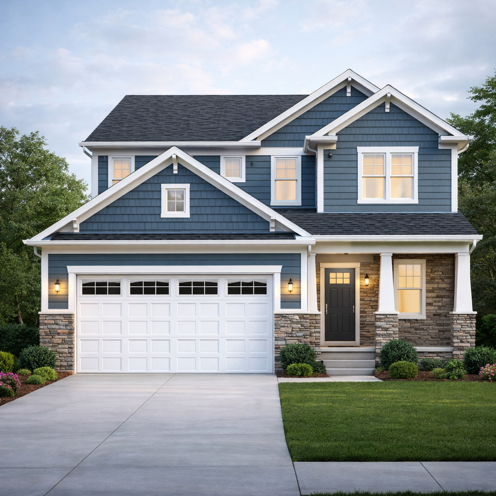

# 🏠 House Photo Matching Project

## 📸 Project Preview

### 🔹 Reference Image



### 🔹 3D Model


### 🔹 Comparison (Real vs Model)


---

## 📌 Description

This project demonstrates photo matching using AutoCAD and SketchUp by recreating a real residential building from a reference image. The focus is on achieving accurate perspective alignment and realistic visualization.

---

## 🛠 Tools Used

* AutoCAD (2D planning & elevation)
* SketchUp (3D modeling & photo matching)

---

## 🔄 Workflow

1. Developed 2D plan and elevation in AutoCAD
2. Imported CAD file into SketchUp
3. Modeled the structure using Push/Pull tools
4. Applied materials and textures
5. Used Photo Match to align model with real image
6. Rendered final views

---

## 🎯 Key Features

* Accurate perspective matching
* Real-world scale approximation
* Clean architectural modeling
* Material and texture application

---

## 📊 Output

* Reference Image
* 3D Modeled View
* Side-by-side Comparison

---

## 🚀 What I Learned

* Practical use of SketchUp Photo Match
* Importance of vanishing points in modeling
* Workflow integration between AutoCAD and SketchUp
* Enhancing realism using materials and shadows

---

## 📁 Project Structure

```
House-PhotoMatch-Project/
│
├── 01_reference/
├── 02_autocad/
├── 03_sketchup/
├── 04_renders/
└── README.md
```
